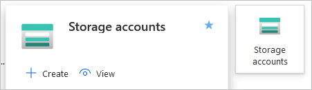
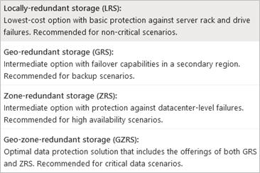
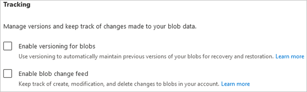
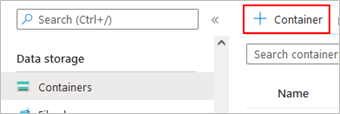
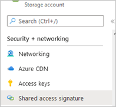

# Blueprint Azure
This document shows an example of how the cloud storage Azure Blob Storage can be connected using Java.

# General

| Detail | Value |
| ------------------------------------ | ------------------------------------------------------------ |
| YouTube Playlist | [here (german)](https://www.youtube.com/playlist?list=PL0GdkoH5F88KqbSBZjWx4zjj2qO85rbwC) |
| Eclipse version used | Eclipse IDE for Java Developers 2021-12 (4.22.0) |
| JRE | JavaSE-17 |
| Created in | Beginning 2022 |
| License | CC0 (except the contents of the screenshots) |

## 1. Setup Cloud Environment

The following shows how to set up the code and blob (Azure name for a bucket) from the web interface.

### 1.1 Account

First, you need to create an account with Microsoft Azure. Free trial accounts are offered. However, a credit card is required for verification. This will only be charged after an upgrade of the account. Furthermore, a mobile phone number is required to receive an unlock code. There are several options for customer support. The free version does not include personal support.

Registration can be done via https://azure.microsoft.com/free/ . No special settings have to be made (see [general instructions for registration](https://docs.microsoft.com/en-us/learn/modules/create-an-azure-account/3-exercise-create-an-azure-account)).

### 1.2 Storage

The console is accessed from https://portal.azure.com/. From the start page, select the Storage Accounts function and create a new account:

First, select a *subscription* and resource *group*. A storage account is a resource manager resource. Therefore, the storage account must be associated with an Azure resource group. Resource groups are used to group Azure services. When creating the storage account, *resource groups* can also be recreated.

After that, a unique *storage account* name is defined. It should be noted that this name must be unique throughout Azure and can only consist of lowercase letters and numbers. It must be between 3 and 24 characters long.

The desired region is then selected. This should be as close as possible to themlater users . However, it should be noted that the regions may have different prices.

 There are two performance options (Standard and Premium). With Premium, there are different subcategories (see [Azure documentation](https://docs.microsoft.com/en-us/azure/storage/blobs/storage-blob-block-blob-premium)). A later switch between the options is not possible. 

Finally, a *Redundancy level* redundancy is selected. The following options are possible:

The other settings do not need to be changed for the test purpose (for explanations of the setting options, see [Azure documentation](https://docs.microsoft.com/en-us/azure/storage/common/storage-account-create)).

Noteworthy is the area of data protection, in which versioning and change tracking can be set. This is associated with additional cost.

After all, settings have been made, the storage account can be created via *Review + create*. This may take a few minutes.

Next, a new container is created under *Containers*. Containers (also called buckets) bundle related blobs (also called objects).

A name, which consists of lowercase letters and numbers, is defined. The *public access level* should be set to Private.

After the container is created, the name is copied to the `Azure_sample_helper` class (variable `blobContainer`).

### 1.3 Key Management System

Key management could be implemented via the Azure Vault. Unfortunately, this cannot be included due to the status of the SDK (see chapter 2.3.1 Client-side encryption).

### 1.4 Roles and Permissions

[Screencast](https://youtu.be/MlPVL6WBJXo) (german, approx. 1 min)

There are two options for accessing the *storage account.* On the one hand, an *access* key can be used, which basically offers full access. Differentiated "authorizations" are available via so-called *Shared access signatures*. These have the advantage that unwanted actions (e.g. due to incorrect operation or misuse) can be partially prevented. For example, it can be set that it is not possible to delete blobs or older file versions with the *shared access signature.*

For this purpose, a new shared access signature is created in the storage account:

With *Allowed services*, it is sufficient if the only blob is selected. Allowed resource *types* select Object. The *Allowed permissions*, *Blob versioning permissions,* and *Allowed blob index permissions* must be selected according to the intended purpose. As well as the other settings.

The *connection string* is copied into the code (class `Azure_sample`, variable `connectStr`). 

In addition to storing the connection string as a variable in the code (or an external file), it is possible to save the *connection string* as an environment variable on the system ([see documentation](https://docs.microsoft.com/en-us/azure/storage/queues/storage-quickstart-queues-java?tabs=powershell#configure-your-storage-connection-string)).

## 2. Development

There are no specific settings to be made for Azure during installation (administrative [download and installation guide](https://www.eclipse.org/downloads/packages/installer)). Installation of the Azure Toolkit is not required for the sample code.

### 2.1 Dependencies

For Maven, the package dependencies are described in the `.pom` file. Azure requires the following packages:

| Group | Artifact | Description |
| --------- | ------------------ | ------------------------------------------------------------ |
| com.azure | azure-sdk-bom | Provides the latest versions of the Azure SDKs. |
| com.azure | azure-storage-blob | Azure Blob Storage Library, contains the required objects and methods. |
| org.slf4j | slf4j-simple | Implementation of the software Logger, displays messages on the console. |

The *Maven Assembly Plugin* in the build area is used exclusively for export as a JAR file. By extending, all dependencies are included in the JAR file, so that this file runs independently.

### 2.2 Starter Class

[Screencast to explain the code structure and execution](https://www.youtube.com/watch?v=md_jKp9Kxto) (german, approx. 3 min)

The Starter class (`Azure_sample.java`) contains the configuration variables, creates the Helper class object, and executes the upload and download method. The *connection string*, the *container name,* and the *name of the blob* are defined (see Chapter 1). The *file name* and the *download directory* can be selected as required.

When you start the program, you receive the following message:

    [main] INFO com.azure.core.implementation.jackson.JacksonVersion - Package versions: jackson-annotations=2.12.5, jackson-core=2.12.5, jackson-databind=2.12.5, jackson-dataformat-xml=2.12.5, jackson-datatype-jsr310=2.12.5, azure-core=1.22.0, version Troubleshooting conflicts: https://aka.ms/azsdk/java/dependency/troubleshoot

It is neither a warning nor an error. This information can be ignored because Maven uses the Jackson version recommended by Microsoft. 

### 2.3 Helper Class

In this class, the necessary objects are created and the methods for uploading and downloading are called. Explanations of the individual methods can be found as comments in the sample code.

#### 2.3.1 Client-side encryption

Unfortunately, client-side symmetric encryption is not feasible at the time of creating this guide (early 2022). This is due to the ongoing revision of the code samples related to the transition to SDK 12.

For more information about encryption, see the [Azure documentation.](https://docs.microsoft.com/en-us/azure/storage/common/storage-client-side-encryption-java?tabs=java) 

With version 8 of the SDK, client-side encryption would be usable. However, this version only receives security updates and would therefore have to be replaced by the new SDK in the medium term.

With client-side encryption, there are basically two options to choose: a key stored in *Azure Key Vault* and an on-premises managed key. *Azure Key Vault* is a service for creating and controlling cryptographic keys. The keys thus lie in Microsoft's infrastructure. The application does not come into contact with the key (see [Azure documentation](https://docs.microsoft.com/en-us/azure/key-vault/general/overview)). When deciding on one of the two variants, a main criterion is which infrastructure (your own or Microsoft's) is most trusted.

By default, the containers and blobs in them are encrypted on the server side. The secure procedure AES 256 bit is used (see [Azure documentation](https://docs.microsoft.com/en-us/azure/storage/common/storage-service-encryption)).

#### 2.3.2 upload

    `BlobServiceClient blobServiceClient = new BlobServiceClientBuilder().connectionString(connectStr).buildClient();

First, an object of type `BlobServiceClient` is created. This allows the following commands to be executed. The connection string from the Starter class is used.

    BlobContainerClient containerClient = blobServiceClient.createBlobContainer(containerName);

A new container is then created and the container client object is created. This step is only required if the desired container does not yet exist.

    BlobClient blobClient = containerClient.getBlobClient(filename);

To edit blobs, the initialization of a blob client is necessary. The container Name variable is defined in the Starter class and contains the file name followed by the file extension.

The file is then uploaded with the following command. The Boolean true indicates that a possibly existing *blob* with the same name (variable `filename`) should be overwritten.

    blobClient.uploadFromFile(uploadPath, true);

For more information about these objects, see the [Azure documentation](https://docs.microsoft.com/en-us/azure/storage/blobs/storage-quickstart-blobs-java?tabs=powershell#object-model).

The variables are the following strings. Because a blob is technically just a binary data object, the file name must be set.

    String downloadFileName = `"MOCK_DATA.csv";`

For the paths, the dot indicates the base path of the files.

    String localPath `= "./data/";`

#### 2.3.3 Download

If the initialization shown earlier has been performed, the download can be triggered using the following method. The target path in the file system and the name of the file from the Starter class are passed as parameters.

    blobClient.downloadToFile`(localPath + downloadFileName);`

## 3. Further information

●Code Examples: https://docs.microsoft.com/en-us/azure/storage/common/storage-samples-java?toc=/azure/storage/blobs/toc.json#blob-samples  
●API Documentation: https://docs.microsoft.com/en-us/java/api/overview/azure/storage-blob-readme?view=azure-java-stable  
●Official GitHub repo: https://github.com/Azure/azure-sdk-for-java/tree/main/sdk/storage/azure-storage-blob  
●Maven Repo: https://mvnrepository.com/artifact/com.azure/azure-storage-blob  
●YouTube Channel: https://www.youtube.com/c/MicrosoftDeveloper/playlists  
